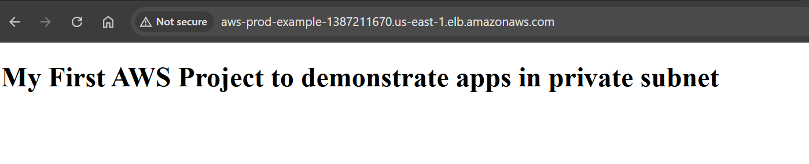
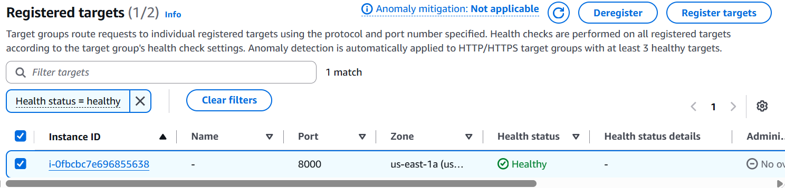

# AWS Private Subnet Web Application

## Overview

This project demonstrates how to deploy a web application on an
EC2 instance in a private subnet and make it accessible through an
AWS Application Load Balancer (ALB).

A bastion host is used to securely access the private EC2 instances
for administration.

## Architecture

```text
                         Internet
                            |
                            | HTTP :80
                            v
                  +--------------------+
                  | Application Load   |
                  | Balancer (ALB)     |
                  | Public Subnet      |
                  +---------+----------+
                            |
                       Target Group
                            |
                            | HTTP :8000
                            v
                  +--------------------+
                  | Private EC2        |
                  | Web Server         |
                  | 10.0.x.x:8000      |
                  +--------------------+

Administration:

                  +----------------+
                  | Administrator  |
                  +-------+--------+
                          |
                         SSH
                          |
                          v
                  +----------------+
                  | Bastion Host   |
                  | Public Subnet  |
                  +-------+--------+
                          |
                    SSH / Private IP
                          |
                          v
                  +----------------+
                  | Private EC2    |
                  +----------------+

## AWS Services Used

Amazon VPC
Amazon EC2
Application Load Balancer (ALB)
Target Groups
Security Groups
Public Subnet
Private Subnet

## What I Implemented

Created an AWS VPC for the application
Configured public and private subnets
Deployed a bastion host in the public subnet
Deployed EC2 instances in private subnets
Configured security groups for controlled network access
Configured an Application Load Balancer
Created a target group for the private EC2 instances
Configured the application to listen on port 8000
Configured ALB health checks
Verified that the private EC2 target became healthy
Successfully served the web application through the ALB
Tested SSH access from the bastion host to the private EC2 instance

## Application

The application is a simple HTML web page hosted on a private EC2
instance.
The web server was started using Python's built-in HTTP server:
python3 -m http.server 8000
The application listens on port 8000.

The Application Load Balancer receives HTTP traffic on port 80
and forwards the request to the private EC2 instance on port 8000.

## Security Architecture

The private EC2 instance does not require a public IP for application
access.
Internet traffic reaches the Application Load Balancer, which forwards
requests to the private EC2 instance through the target group.
Administrative SSH access is performed through the bastion host using
the private IP address of the EC2 instance.

Internet
   |
   v
Application Load Balancer
   |
   v
Private EC2
   |
   v
Web Application


Administrator
   |
   v
Bastion Host
   |
   v
Private EC2

## Technologies

AWS
Amazon VPC
Amazon EC2
Application Load Balancer
Linux
Ubuntu
Python
HTML
SSH
Security Groups
VPC Networking

## Key Learning Outcomes

Through this project I gained hands-on experience with:
AWS VPC networking
Public vs private subnets
EC2 deployment
Bastion host architecture
Private IP based communication
SSH authentication
Security Group configuration
Application Load Balancer configuration
Target Group health checks
Deploying an application on a private EC2 instance

## Project Result

The application was successfully accessed through the public
Application Load Balancer while the web server remained inside
the private subnet.
The private EC2 instance was not directly exposed to the Internet.

## Project Status

Completed.
The AWS infrastructure was deployed temporarily for hands-on
testing and demonstration.


## Screenshots

### Application running through the Application Load Balancer

The web application is hosted on an EC2 instance in a private subnet
and is accessed through the public Application Load Balancer.



### ALB Target Group Health Check

The private EC2 instance is registered with the target group and
successfully passes the configured health check.



## Skills Demonstrated

- AWS VPC networking
- Public and private subnet design
- Amazon EC2
- Application Load Balancer
- Target Groups and health checks
- Security Groups
- Bastion host configuration
- Linux server administration
- SSH and private-key authentication
- Python HTTP server
- Basic HTML
- AWS troubleshooting and networking

## How Traffic Flows

1. A user sends an HTTP request to the Application Load Balancer.
2. The public ALB receives the request on port 80.
3. The ALB forwards the request to a registered EC2 target.
4. The EC2 instance is located inside a private subnet.
5. The web application listens on port 8000.
6. The target group's health check verifies that the application is available.
7. Administrators access the private EC2 instance through the bastion host using SSH.

